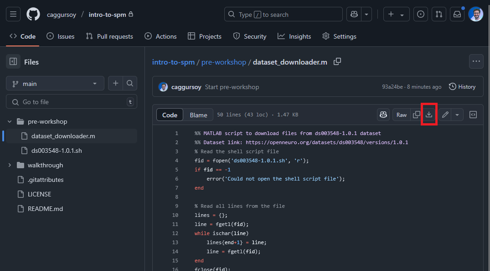
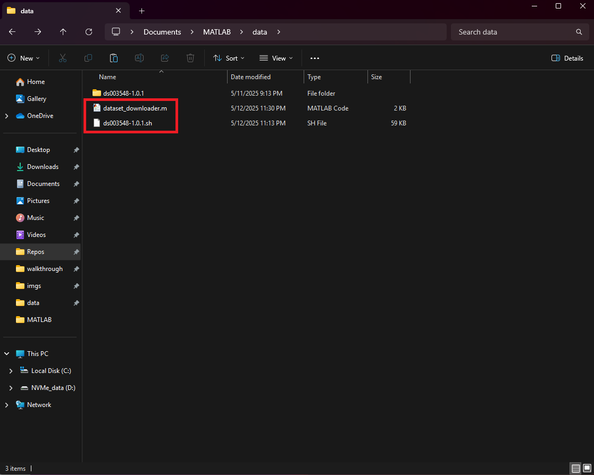
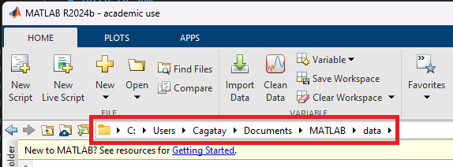
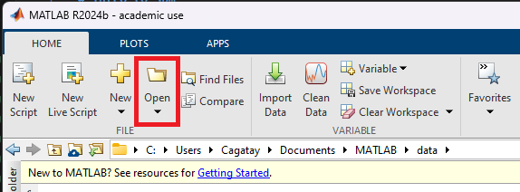
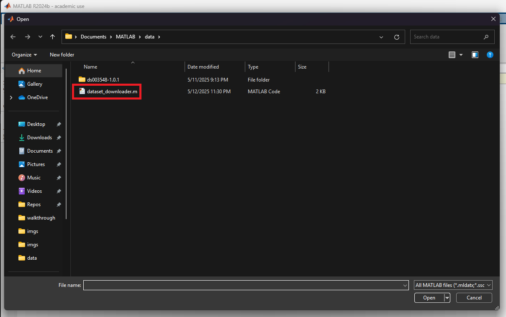
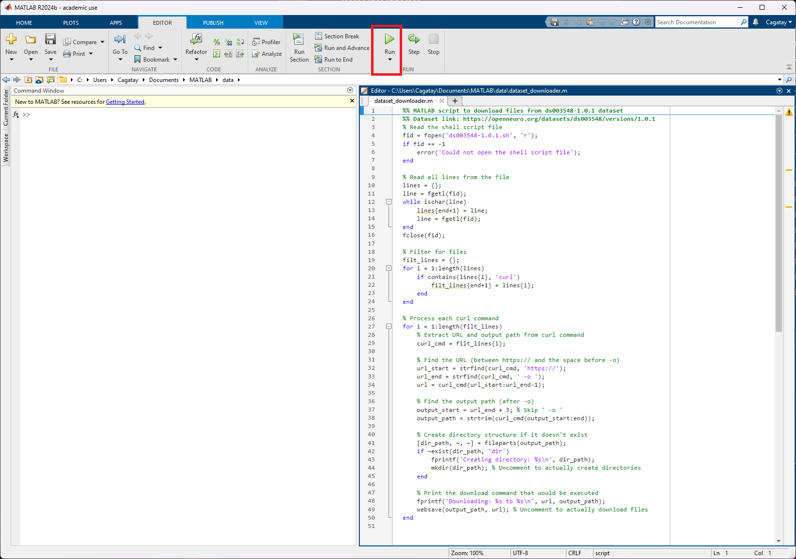
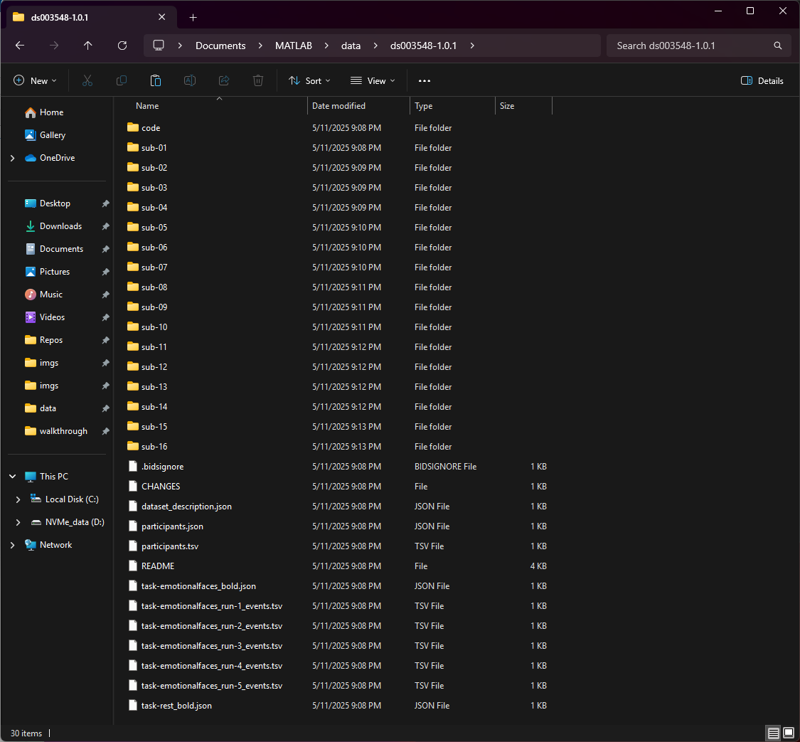

# Pre-workshop guide
- Please ensure you have MATLAB (a recent version would be perfect) running on your computer.
- Now download both [dataset_downloader](./dataset_downloader.m) MATLAB script and [ds003548-1.0.1](./ds003548-1.0.1.sh) bash script.

- After downloading both of the files, copy them to a directory where the raw data will be downloaded by the MATLAB script.

- Now start MATLAB, change the working directory to the directory where you have placed the script files in the last step

- Open the MATLAB script and run it so the raw data files will be downloaded

- When all the files are downloaded, it should look something like this:

## **Congrats!** You have now succesfully downloaded the dataset

## Now head over to  part to download and install SPM