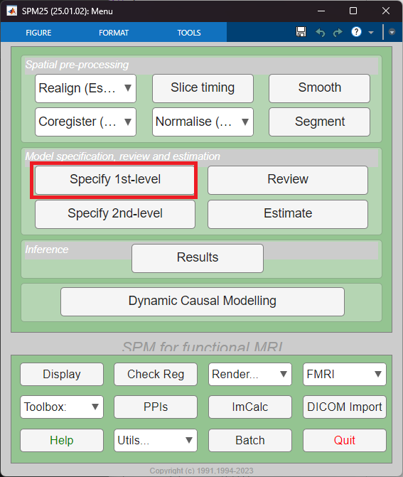
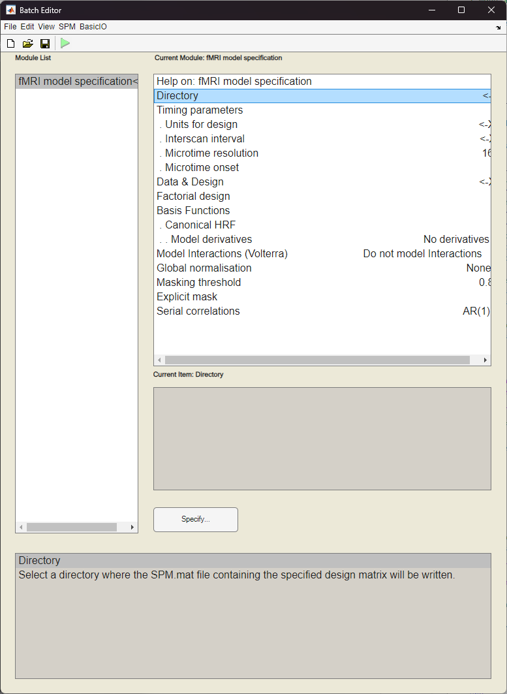
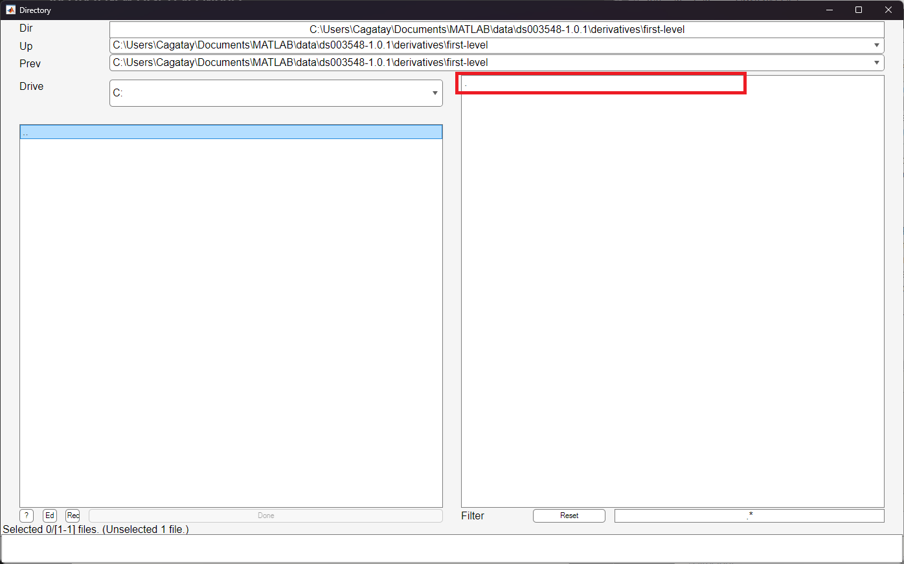
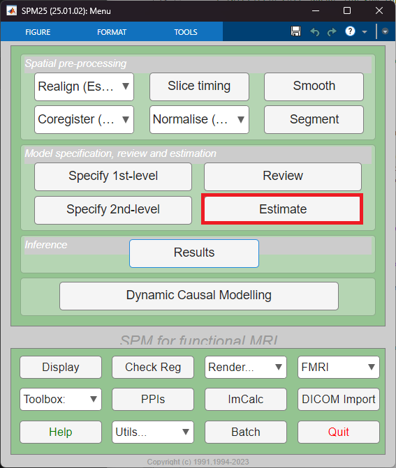
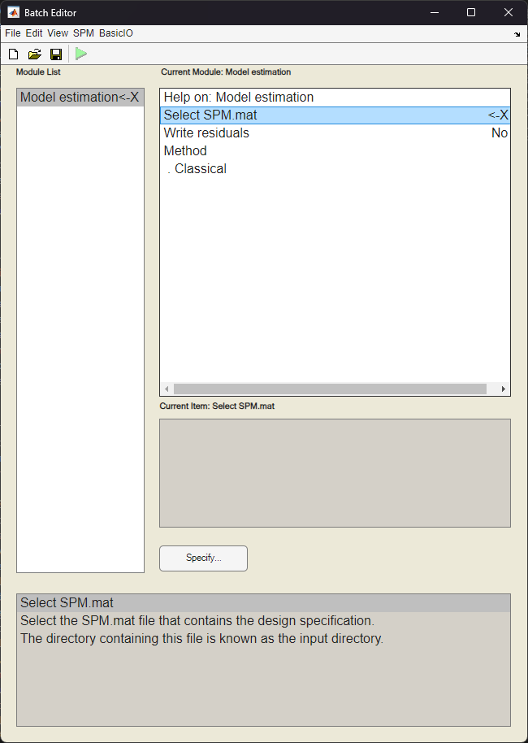

# First-Level Analysis
SPM First level analysis with using BIDS

At first we'll start by specifying and estimating a First-Level Model for only one subject; then we'll move on to the scripting to do this for all subjects in an experiment at one go!

## Specify a First-Level Model
- In the SPM GUI, click ‘fMRI model specification’ (or ‘Specify 1st-level’).

- You will reach the main first level specification menu

- Now you need to set the required parameters:
    - **Directory:** Choose a new folder where SPM will save the first-level analysis results for this subject.
        - As we are working with BIDS, this must be in the `derivatives` folder. So go to the `derivatives` folder and create a new directory called `first-level`
        - After you've created the `first-level` directory select it via clicking the *Specify* button
        - You have to click the `.` on the right side of the folder selection menu to select the *first-level* folder
        
    - **Timing Parameters:** Next up, the timing
        - BIDS databases provide event timings for task related fMRI recordings in the shape of `.tsv` files
        - In our case it is the `task-emotionalfaces_run-1_events.tsv` file
        - BIDS format dictates that the timings in the `_events.tsv` files are always in seconds, so for *Units for design* we select *Seconds*
        - The *Interscan interval* is usually the *TR* value that we have previously used. In some cases this is different, but for those cases it is clearly provided. So we type in *2*
        - For *Microtime resolution* and *onset* default values are usually fine unless you have a fast event-related design.
    - **Select Scans (Functional Images):** Now we select the preprocessed files from the `derivatives/preprocessing` directory
        - Click on *New: Subject/Session* and start the file selection menu by clicking *Scans* then *Specify*  
        - To select the preprocessed files, when in the `derivatives/preprocessing` directory type ``^swrasub-01_task-emotionalfaces_run-1_bold\.nii`` (take care, we have specified sub-01 here) to the *Filter* bar and in the *Frames* box type in `[1 Inf]` then recursively search for files and click *Done*
    - **Define Experimental Conditions**: We have to define each condition (e.g., ‘Task’, ‘Rest’, ‘Stimulus A’) and the condition names and timings are always in the `_events.tsv` file for BIDS datasets
        - For designs with 1-2 conditions it's easy to create it by hand; but for designs with more conditions you can convert the `_events.tsv` file to a `.mat` file and feed it to the First level specification
        - For that, you can use the MATLAB function file I've provided; `create_spm_multiple_conds`
        - Example usage for this case: `create_spm_multiple_conds('task-emotionalfaces_run-1_events.tsv', 'multiple_conditions.mat')`
        - This will create a `.mat` file with the conditions that we need. Go to *Multiple conditions* on the menu and select this `.mat` file 
        - You can leave the rest of the options as is.
- Click *Play* - *Run Batch* again on the top menu to run the specification

## Estimate a First-Level Model
- In the SPM GUI, click *Estimate*

- You will reach the main first level estimation menu

    - Now choose the `SPM.mat` file that was the result of the previous First-level specification step
    -  For *Write residuals*, choose *Yes*
- Click *Play* - *Run Batch* again on the top menu to run the estimation

8. Model Estimation

    In the SPM GUI, click ‘Model estimation’.
    Select the SPM.mat file you just created.
    Click ‘Run’. SPM will estimate the GLM parameters.

9. Specify Contrasts

    In the SPM GUI, click ‘Contrast Manager’.
    Select the SPM.mat file.
    For each contrast:
        Click ‘New T-contrast’.
        Name: Enter a name (e.g., ‘Task > Rest’).
        Weights: Enter the contrast vector (e.g., [1 -1] for Task > Rest).
        Click ‘OK’.
    Repeat for all desired contrasts.

10. Review and Run Contrasts

    Click ‘Done’ to save contrasts.
    SPM will compute the contrast images (e.g., con_0001.nii).

11. View Results

    In the SPM GUI, click ‘Results’.
    Select the SPM.mat file and the contrast you want to view.
    Set the statistical threshold (e.g., p < 0.001 uncorrected, or FWE/FDR corrected).
    Click ‘Go’ to view the statistical maps.