# Preprocessing
SPM preprocessing for BIDS

## Slice timing
- Correct for differences in acquisition time between different slices in each volume.
- This is important for fast TR (repetition time) designs.
- SPM allows you to specify the slice order and reference slice.

## Realignment
- Correct for subject movement during scanning.
- SPM estimates the translation and rotation parameters to align all images to a reference image.
- This step typically involves selecting a reference image (e.g., the first image of the first run).

## Segmentation
- Segment the structural image into different tissue classes (e.g., gray matter, white matter, CSF).
- This is used for spatial normalization and can also be used for tissue volume analysis.

## Coregistration
- Align the functional images to the structural image.
- This step is crucial for accurate spatial normalization.
- SPM uses mutual information to find the optimal transformation.

## Normalisation
- Warp the structural and functional images to a standard space (e.g., MNI or Talairach).
- This allows for group-level analysis.
- SPM uses the DARTEL (Diffeomorphic Anatomical Registration Through Exponentiated Lie Algebra) or unified segmentation approach.

## Smoothing
- Apply a Gaussian kernel to smooth the images.
- This increases the signal-to-noise ratio and accounts for individual differences in anatomy.
- The kernel size (FWHM - Full Width at Half Maximum) should be chosen based on the expected size of the activation.

## Step -1! Check origins of each anatomical file!
- One **'automatic'** option: https://github.com/rordenlab/spmScripts/blob/master/nii_setOrigin.m
- Another: By hand with check registration function:
    - Go to Command Window on MATLAB
    - Type the following
    ```matlab
    anat_aux = {dir('/**/anat/sub*_T1w.nii')}; % get the original anatomical files
    anat_aux = anat_aux{1}; % MATLAB/SPM logic for cell vectors
    anat_files = strcat({anat_aux.folder},filesep,{anat_aux.name}); % create full filepaths for each anat file
    for i=1:length(anat_files) % now loop over every anat file
        spm_image('Display', anat_files{i}) % display each image
        fig_handle=gcf;
        waitfor(fig_handle) % and wait until the previous window is destroyed(closed)
    end
    ```


## **Slice Timing**
- We start preprocessing with slice timing of functional recordings
- Start SPM by going to MATLAB's Command Window and typing `spm fmri`
- The SPM menu will pop up on your screen
- On top, you will see the options for preprocessing
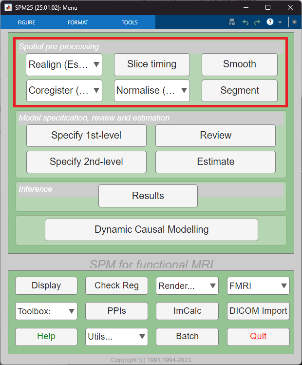
- Now click on *Slice timing*
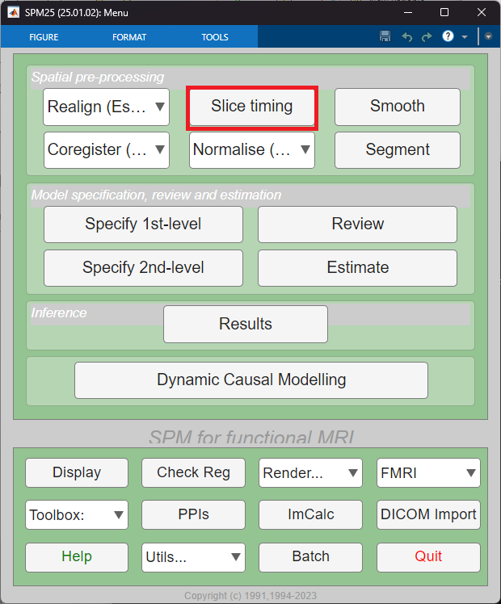
- The *Slice timing* window will pop up
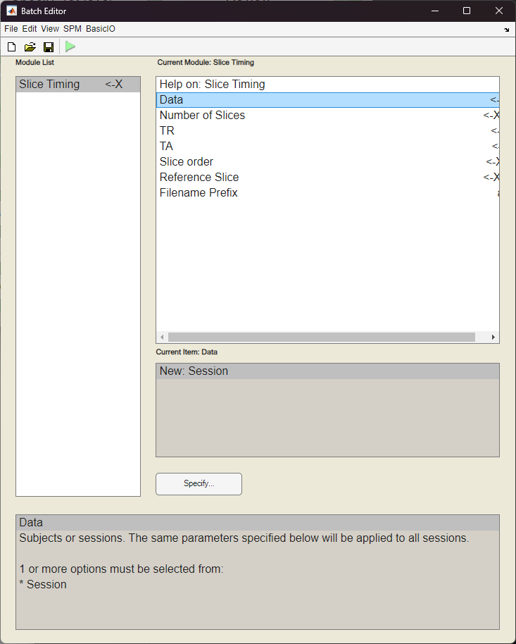
- At this point, there are 5 important information regarding the data you must know: *Number of slices*, *TR*, *TA*, *Slice order* and *Reference slice*
- If you have a BIDS dataset, you're lucky all those information are saved in the `.json` files called *sidecar* files
- In the main BIDS directory, you should find a `.json` file with the name of the task we are analysing
    - For our case it is `task-emotionalfaces_bold.json` because we're dealing with *emotionalfaces* task.
    - Now open the file `emotionalfaces_bold.json` on MATLAB (or another text editor)
    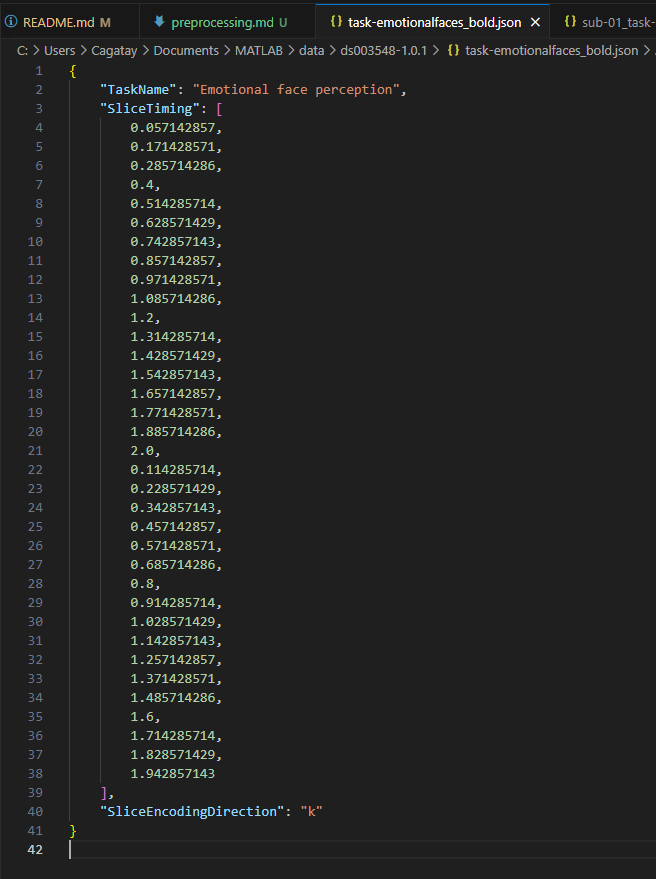
    - This file should have some of the required information
    - For our case, we can find the *Slice timing* information
    - Copy the *Slice timing* information and paste it to MATLAB, and create a variable called `sliceTiming`
    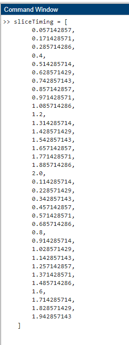
    - Now to get the *Number of slices* information, run the following command: `length(sliceTiming)`
    - And to get the slice order properly from the variable we have to sort the `sliceTiming` vector. Just type `[~, slice_order] = sort(sliceTiming);` to the Command Window on MATLAB and you'll have the sorted *Slice order* vector
    - We cannot find any more information in this `.json` file and we should move on to the subject-wise sidecar files
- Just go to any subject's main directory, then to the `func` directory and you should see the `.json` files there 
- For our case, we will move on with *run1* so in the `func` directory of the participant, open the file `sub-01_task-emotionalfaces_run-1_bold.json` on MATLAB (or another text editor)
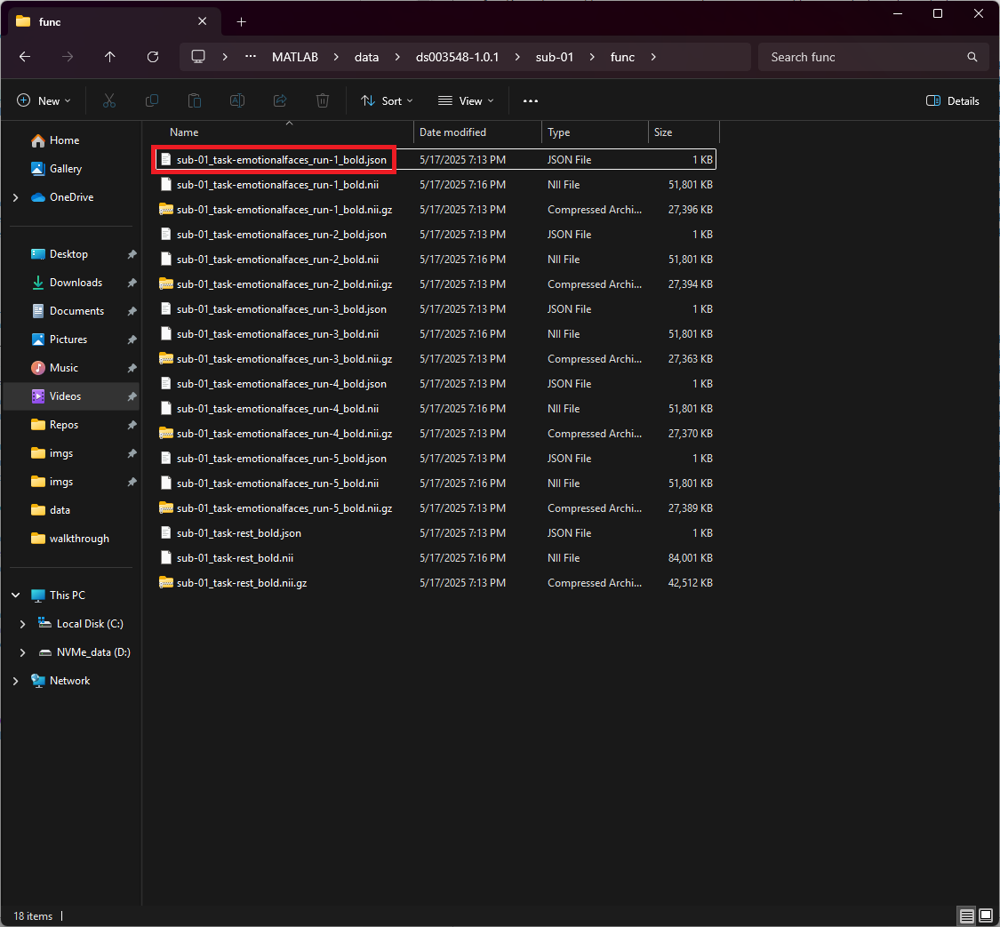
- In the file, you will see a bunch of information; some of them are useful now
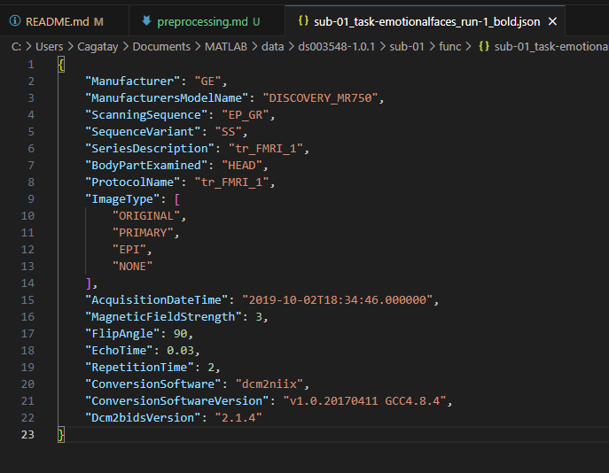
    - In order to find the *TR*, we look at the line: `"RepetitionTime": 2,`
    - So our *TR* is 2
    - *TA* can be calculated by the following formula *TA* = *TR* - (*TR* / *Number of Slices*)
- And as the *reference slice*, we can take the middle slice, as this is one of the common choices.
- Now let's input everything in the *Slice Timing* SPM menu:
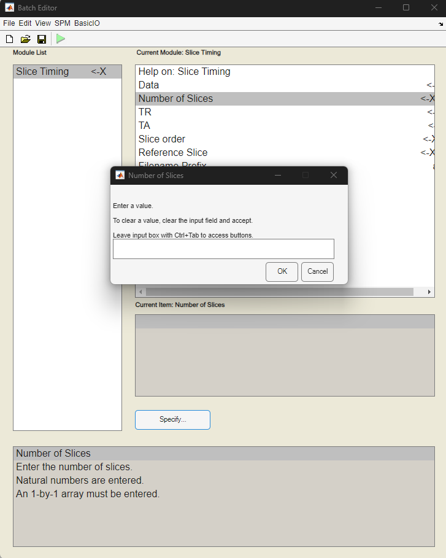
    - Click on *Number of slices* then to *Specify* and put `length(sliceTiming)` in the appeared textbox
    - Same for *TR* and enter 2
    - For *TA*, we can just plug the unknowns in the respective formula and type it into the textbox: `2 - (2/35)`
    - For *Slice order*, we'll just input the `slice_order` variable in the textbox
    - As *Reference Slice* we'll put `round(length(sliceTiming) / 2)` so we get the middle slice
    - And now the most important part, selecting the data!
        - Click *Data* then in the bottom menu `New: Session`
        - Now you should see the `.Session` on the top menu, click on it then to *Specify*
        - A file selection menu should appear
        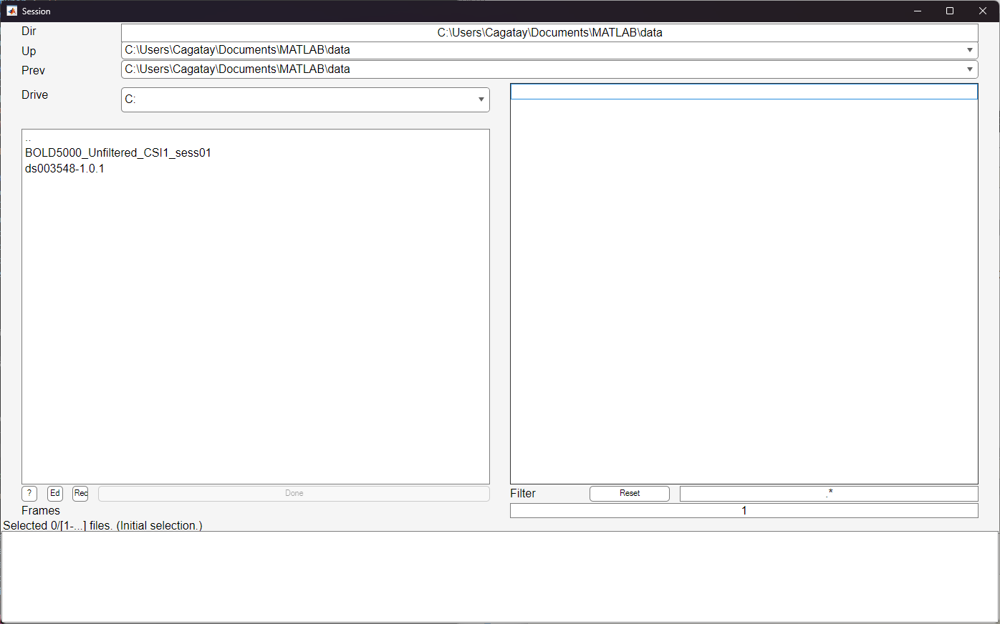
        - Now you should move on to the BIDS main directory, where you see all the *sub-xx* directories
        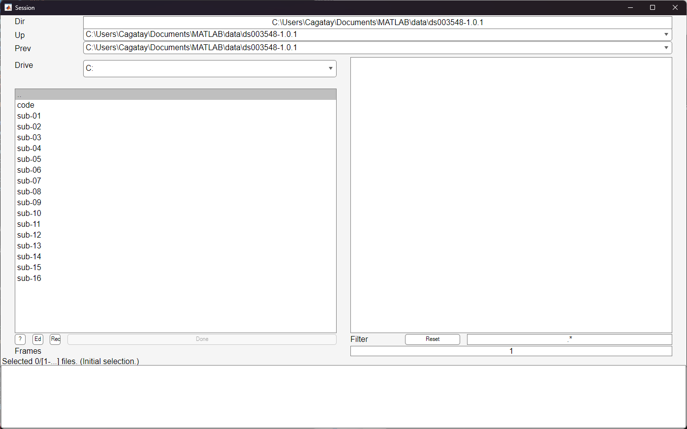
        - Here, we'll select the *run1* data for all *emotionalfaces* task
        - For that on the *Filter* menu at the bottom-right side we have to put some regular expression search terms
        - In each participant, the filename we are looking for is: `sub-xx_task-emotionalfaces_run-1_bold.nii`. So we put `sub-\d+_task-emotionalfaces_run-1_bold\.nii` as the regexp search pattern, which matches filenames that start with *sub-*, followed by one or more digits, then *_task-emotionalfaces_run-1_bold*, and ending with *.nii*, ensuring the entire filename adheres to this specific pattern.
        - When you click on the *Rec* button on bottom-left it will search for all files and give you a list. Now you should have a total of 16 files at the bottom box
        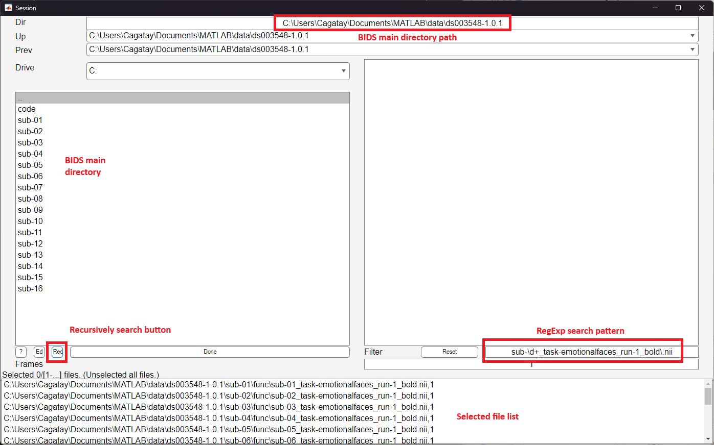
        - Click *Done*
        - Leave the *Filename Prefix* as is; this is the SPM's own conventional naming scheme
- Now every field should be filled and should look like this:
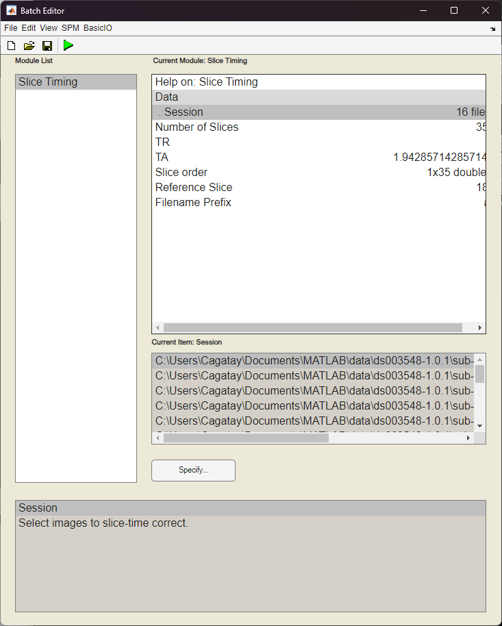
- Click the green *Play* - *Run Batch* button on the top menu

## Realignment
- Time for spatial realignment
- In main SPM menu, click on *Realign* and choose *Realign (Est&Res)*
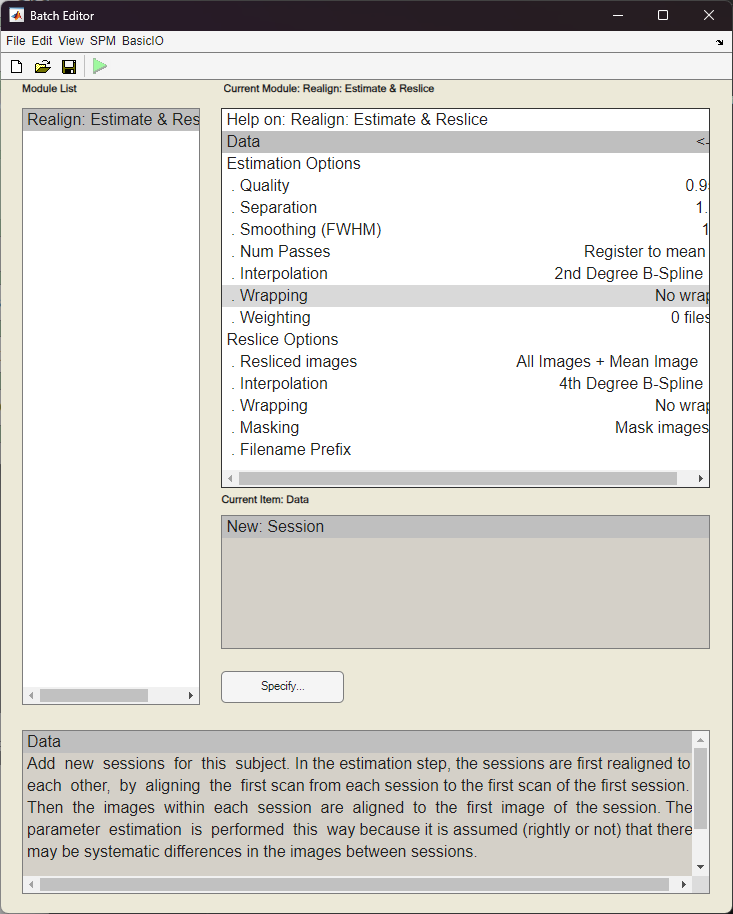
    - As *Data* we select the previously *Slice timed* data
    - Again Click on *New: Session* and go to file selector by clicking *.Session* from top menu and *Specify* from bottom menu
    - Now in the search bar, we put `asub-\d+_task-emotionalfaces_run-1_bold\.nii`
    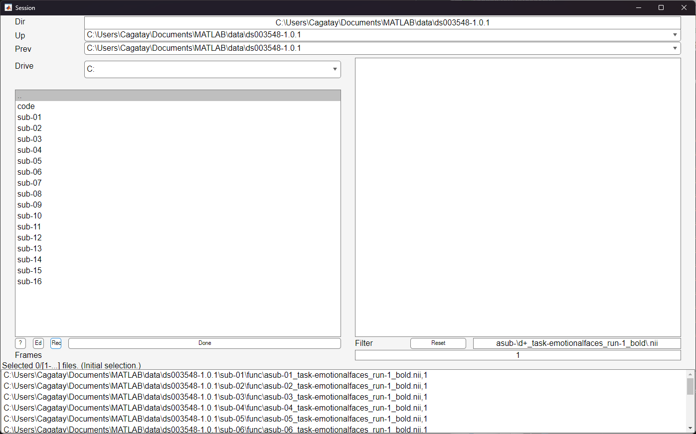
    - Click *Done* and your files are now selected
    - For rest of the fields, we can use SPM defaults as long as we do not have any specific requirements
- Click *Play* - *Run Batch* again on the top menu

## Segmentation
- Now we handle the segmentation of anatomical files
- Click *Segment* on the main SPM menu

    - Now select *Channel - Volumes* on the menu and here we must find the anatomical files
    - In the search bar, type `sub-\d+_T1w\.nii` and once again recursively search with *Rec* button. Then click *Done* and confirm the found files
    - In the *Save INU corrected* option we select *Save\* INU corrected* as this is what we'll need in the future steps
    - For each of the *Tissues* options we should select *None* in the *Native Tissue* option as this will create files that we will not use in the future
    - Now scroll down to the end, in *Deformation fields* we need to save *Inverse + forward* so we have both of the files saved to the disk
    - Rest of the options can be left alone, SPM defaults are more than enough if one do not have specific requirements
- Click *Play* - *Run Batch* again on the top menu; and now this step might take some time

## Coregistration
- Now to coregistration
- In main SPM menu, click on *Coregister* and choose *Coregister (Est&Res)*
    - For *Fixed Image* we will use the original anatomical files for each participant. To do that, click *Specify* to start the file selector window; and put `^sub-\d+_T1w\.nii` in the search box on bottom right so we'll select the anatomical files
        - Be careful, at this step we have added `^` in the beginning so the newly created segmentation files are not selected
        - This will select the first subject's image; and this is what we need.
    - Recursively search and confirm the selections by clicking *Done*
    - Now for *Moved Image* we select meaned EPI file for all participants with `^meanasub-\d+_task-emotionalfaces_run-1_bold\.nii`
    - And for *Other Images* we select all functional files that was procesed before with `^rasub-\d+_task-emotionalfaces_run-1_bold\.nii`
    - Rest of the options we leave as SPM defaults
- Click *Play* - *Run Batch* again on the top menu; again this step might take some time

## Normalisation
- Now to Normalisation
- In main SPM menu, click on *Normalise* and choose *Normalise (Write)*
    - For *Deformation Field* we select the field that was created in the segmentation step for each participant with `^y_.*\.nii$`. At this step SPM might already fill the search field by a RegExp expression but we have to change this to find the correct one.
    - Click *Done* and select the first participant's field
    - For *Images to Write* we select the previously processed functional files with `^rasub-\d+_task-emotionalfaces_run-1_bold\.nii` 
    - Leave *Bounding box* as is
    - For *Voxel sizes* [2 2 2] is the default option but choosing [3 3 3] would make it more *honest*
    - And for *Interpolation* we choose *7th Degree B-Spline* to have the highest degree of interpolation
- Click *Play* - *Run Batch* again on the top menu

## Smoothing
- Finally, Smoothing
- Click *Smoothing* in the main SPM menu
    - For *Images to smooth* we select the previously processed functional files with `^wrasub-\d+_task-emotionalfaces_run-1_bold\.nii` 
    - Leave the rest as defaults
- Click *Play* - *Run Batch* again on the top menu

 
    

## BONUS 2! BIDS format derivative file arranging