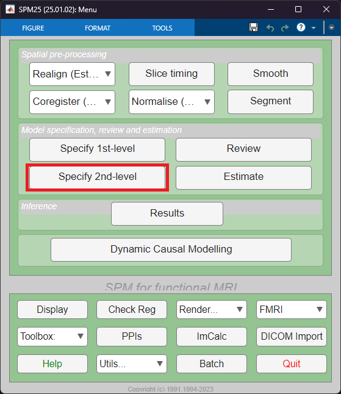

# Second-Level Analysis
SPM Second (Group) level analysis with using BIDS

At first we'll start by specifying and estimating a Second-Level Model, for one of the contrasts we have defined in the previous step; then we'll move on to the scripting to handle all the contrasts!

## Specify a Second-Level Model
- In the SPM GUI, click **Specify 2nd-level**

- You will reach the main second level specification menu

- Now you need to set the required parameters:
    - **Directory:** Choose a new folder where SPM will save the first-level analysis results for this subject.
        - As we are working with BIDS, this must be in the `derivatives` folder. So go to the `derivatives` folder and create a new directory called `second-level`
        - After you've created the `second-level` directory select it via clicking the *Specify* button
        - You have to click the `.` on the right side of the folder selection menu to select the *first-level* folder
    - **Design:** Here we choose the type of statistical test. There are many tests avaiable, but for our case a *One-sample t-test* would suffice
        - Move to *Scans* and select all `con_0001.nii` files of all participants by searching for `con_0001.nii` in the `derivatives\first-level` directory
    - You can leave the rest of the options as is.
- Click *Play* - *Run Batch* again on the top menu to run the specification
- After the calculation is completed, save the settings of this step to a `.mat` file as a batch by clicking the `Save` icon on the top menu

## Estimate a Second-Level Model
- In the SPM GUI, click *Estimate*

- You will reach the main estimation menu

    - Now choose the `SPM.mat` file that was the result of the previous Second-level specification step
    -  For *Write residuals*, choose *No*
- Click *Play* - *Run Batch* again on the top menu to run the estimation
- After the calculation is completed, save the settings of this step to a `.mat` file as a batch by clicking the `Save` icon on the top menu

