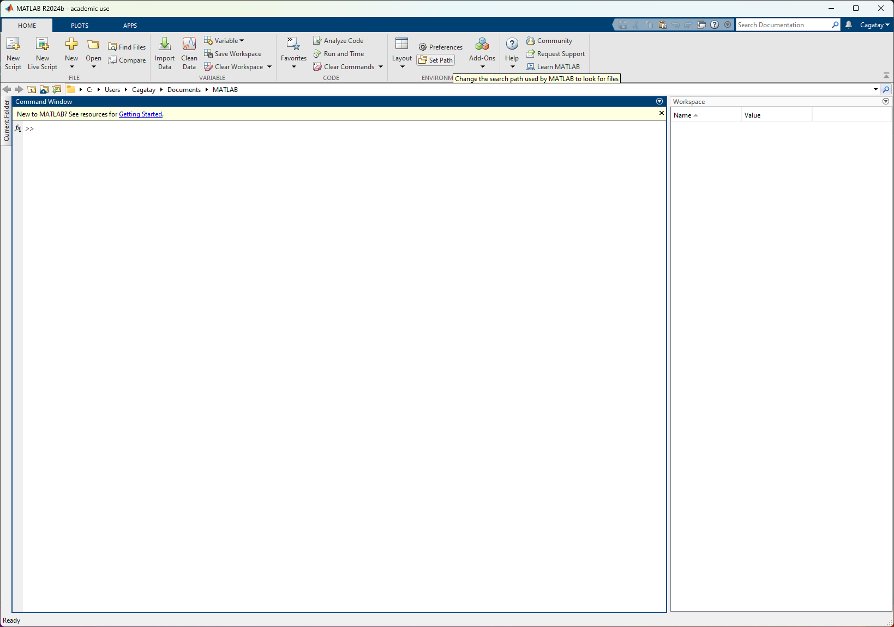
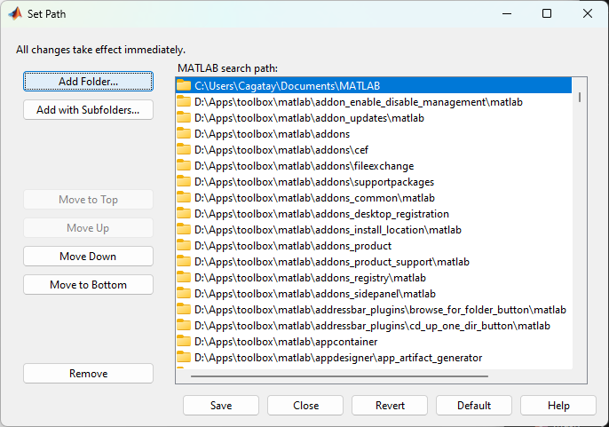
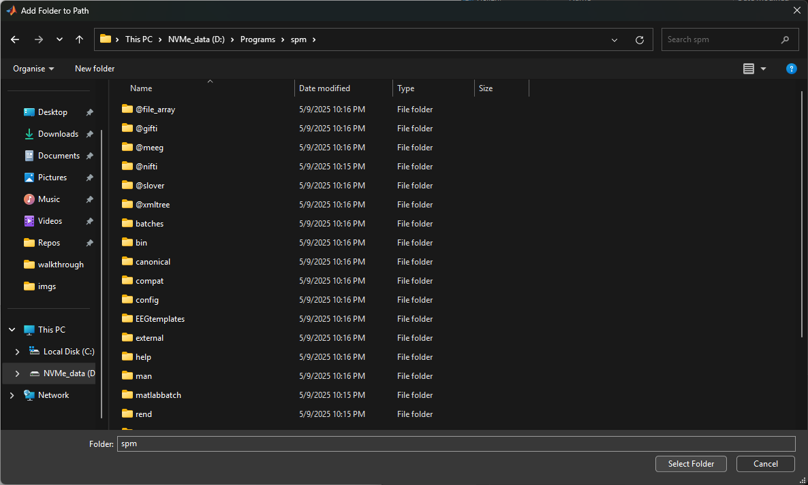
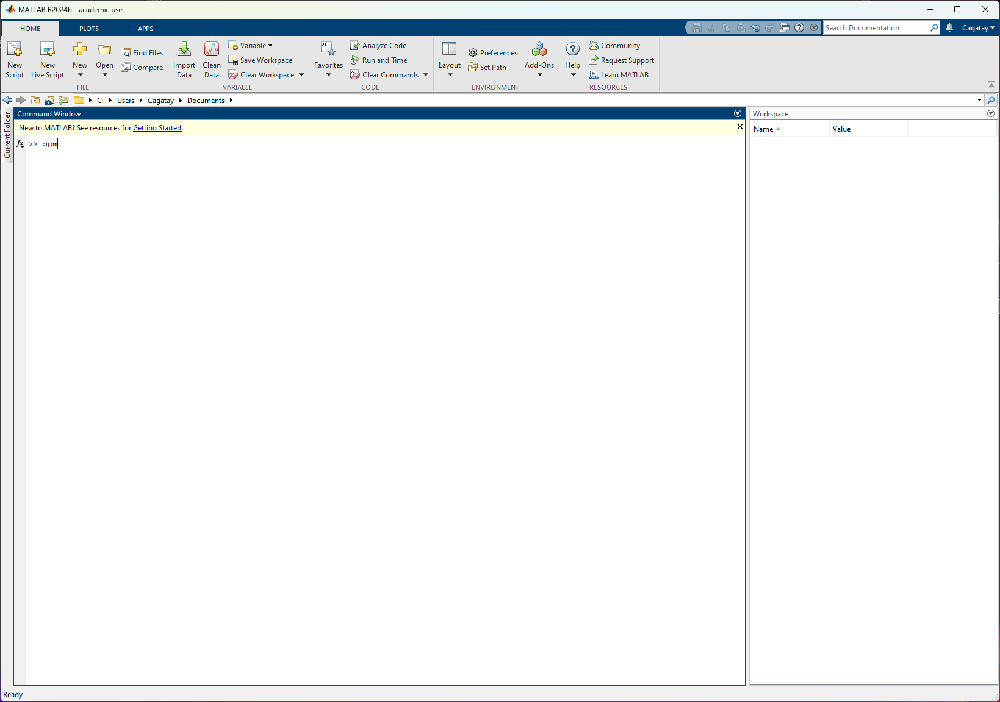
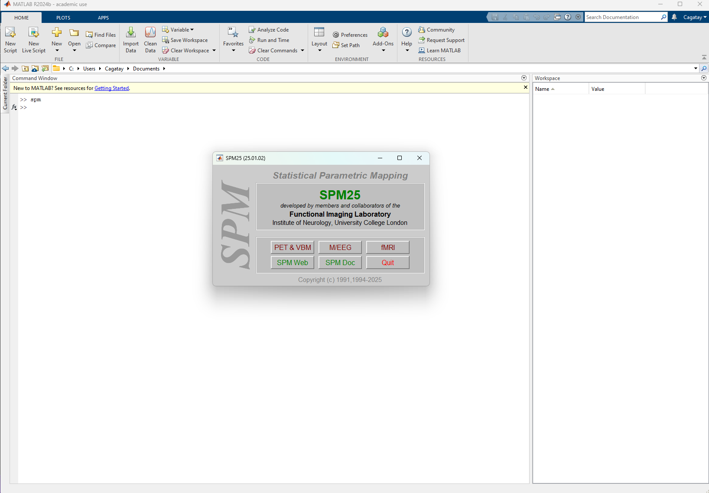
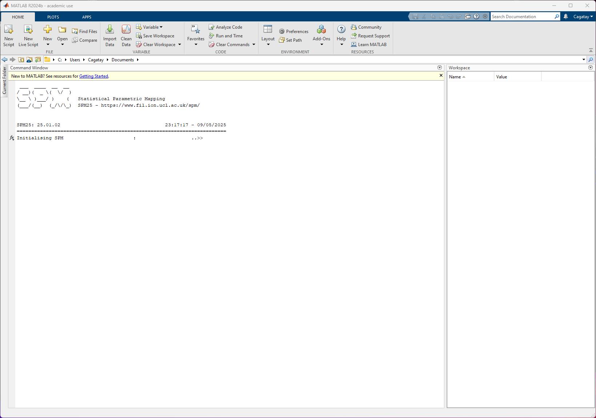
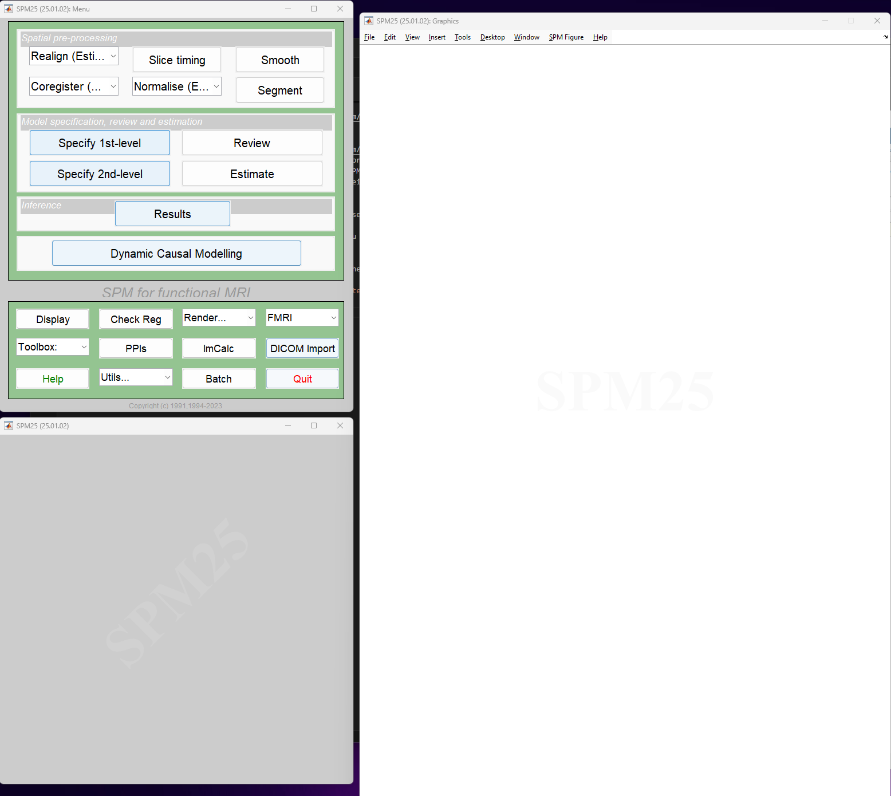

# SPM installation

- Go to official SPM [GitHub repository](https://github.com/spm/spm)
- Download the appropriate version
    - Current version: 25.01.02 (as of May 2025) 
    - Download directly from this [link](https://github.com/spm/spm/releases/download/25.01.02/spm_25.01.02.zip)
- Now unzip the downloaded `spm_<version>.zip` to a directory of your choice
    - This directory will be the permanent directory for SPM, so choose wisely. Not just `Downloads/SPM` please!
- Now start MATLAB and add the SPM to your MATLAB's path, either by GUI Set Path editor or with the MATLAB Command Window 
    - GUI Set Path editor:
        - Click on the Set Path button on the Environment section of the top menu pane
        - 
        - Now click on `Add Folder` button. Be careful, you **should not click** the `Add with Subfolders` option. SPM will handle this
        - 
        - Find the path of your SPM folder and add it to the MATLAB path
        - 
        - Now in the Command Window type spm and press `Enter` to initialise SPM
        - 
        - 
        - Now you should see the main menu of SPM. Choose `fMRI`
        - 
        - Finally you should have arrived at the main view of the SPM fMRI interface
        - 
- **Congrats!** You have installed and initialised SPM!
